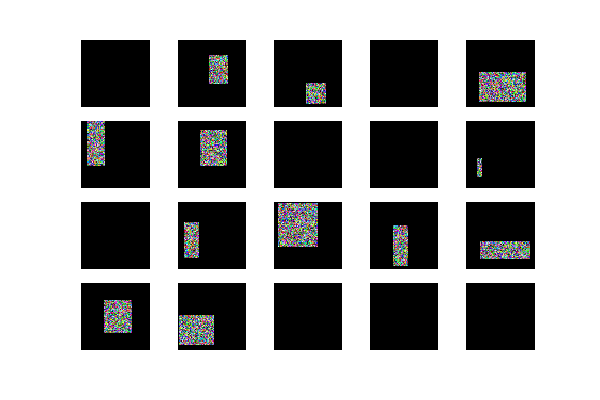
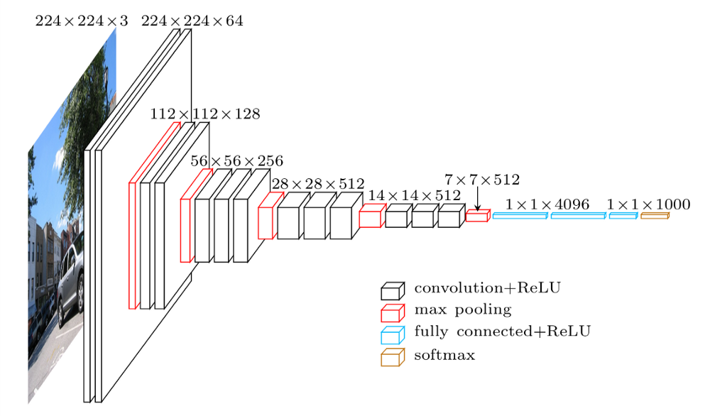
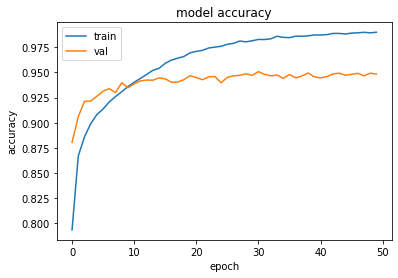
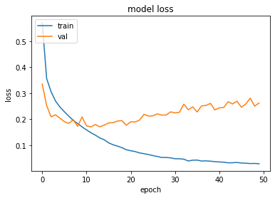

# Introduction

This repository shows two different approaches to image classification for fashion-mnist dataset. First is an implementation of K Nearest Neighbours classifier, and the second one is a simple variation of Convolutional Neural Network, inspired by VGG16 network. Furthermore, I tried to compare my results with already existing benchmarks.
### Dataset
Fashion-mnist is a dataset of Zalando's article images. It consists of 60000 training and 10000 test images (28x28 pixels each) with associated labels. There are 10 classes of labels.

My goal is to, using provided training data, build a model that will be able to successfully classify (most) images of clothing from the test data.
# Methods
## KNN
For this part, I used my implementation of K Nearest Neighbours classifier, which I had previously used for text analysis for my System Analysis and Decision Support Methods class. There was one problem - it used hamming distance as a distance metric, and it cannot be applied to non-binary data. The solution was simple - I used euclidean distance instead. 

<distance>

In order to make the computations faster I used cupy instead of numpy in some critical sections in code. Thanks to it, calculating distance matrix is really fast, especially if run on powerful GPU (eg. using Google Colab).

    def distance(X, X_train):
	    X = cp.asarray(X)
		X_train = cp.asarray(X_train)
		return cp.asnumpy(-2 * cp.dot(X, X_train.T) + cp.sum(X_train**2, axis=1) + cp.sum(X**2, axis=1)[:, cp.newaxis])

The results can be seen in Results section
## CNN

#### Data preparation
Fashion-mnist dataset is loaded automatically using keras datasets. Next, the training data is shuffled, and validation data is separated. 
```
# Shuffle
indexes = np.arange(x_train.shape[0])
indexes = np.random.permutation(indexes)
x_train = x_train[indexes]
y_train = y_train[indexes]

# Separate val data
x_val = x_train[:n_val]
y_val = y_train[:n_val]
x_train = x_train[n_val:]
y_train = y_train[n_val:]
```
Pictures in this dataset are 28x28 arrays with values ranging from 0 to 255. To normalize them, I simply divide every value by 255.0. Next, the data is reshaped to fit into keras functions. 

```
# Normalize
x_train = x_train.astype('float32') / 255.0
x_val = x_val.astype('float32') / 255.0
x_test = x_test.astype('float32') / 255.0

# Reshape
x_train = np.reshape(x_train,  (x_train.shape[0],  28,  28,  1))
x_val = np.reshape(x_val,  (x_val.shape[0],  28,  28,  1))
x_test = np.reshape(x_test,  (x_test.shape[0],  28,  28,  1))
```


Then, the data is passed into ImageDataGenerator, to augment the pictures a bit. I used random rotation, width and height shift, shear and zoom. 
Additionally, I preprocess the images using a random erasing method. It tries to regularize models by randomly masking images with random values.



```
datagen = ImageDataGenerator(rotation_range=8, 
                             width_shift_range=0.08,
                             shear_range=0.3,
                             height_shift_range=0.08,
                             zoom_range=0.08,
                             preprocessing_function=get_random_eraser(v_l=0, v_h=1, pixel_level=True)
                             )
```

Finally, transformed data is concatenated to plain training data.

#### Model
For CNN I went with small VGG-like network architecture. It is characterized by its simplicity, using only _3×3_ convolutional layers stacked on top of each other. Reducing volume size is handled by max pooling. 



The basic feature learning happens here:
```
model.add(Conv2D(filters,  (3,  3), padding="same", kernel_initializer=initializer))
model.add(BatchNormalization())
model.add(Activation("relu"))

model.add(Conv2D(filters,  (3,  3), padding="same", kernel_initializer=initializer))
model.add(BatchNormalization())
model.add(Activation("relu"))

 
model.add(MaxPooling2D(pool_size=(2,  2)))
model.add(Dropout(dropout))
```
This block is then stacked multiple times, with different filter numbers throughout the model.

Compared to original VGG network architecture, I added BatchNormalization and Dropout layers. There is a slight disagreement over where to place BatchNormalization. I decided to put in between the linear and non-linear layers. The Dropout layer is added for regularization, it makes it harder for network to just "remember" the data, and make it focus more on generalizing.


Finally, there are two fully connected layers, and a softmax activation layer:
```
 model.add(Flatten())
 model.add(Dense(filters * 4))
 model.add(BatchNormalization())
 model.add(Activation("relu"))
 model.add(Dropout(0.5))
 
 model.add(Dense(10))
 model.add(Activation("softmax"))
```

For this model, im stacking the previously mentioned conv->pool layers 3 times, with 64, 128 and 256 filters, he_normal kernel initializer and a dropout rate of 0.25. The summary of the model can be seen here:  

summ


#### Training
Model is compiled using the Adam optimizer. It's an adaptive learning rate optimizer, making it much better than plain SDG.

For training, I used 50 epochs and a batch size of 256. 






# Results
As expected, CNN clearly outperformed KNN by over 9%.   
Test loss: 0.298
Test accuracy: 0.947
| Method  | Accuracy | 
| ------------- | ------------- | 
| KNN | 85.1% | 
| CNN  | 94.7% | 

## KNN comparison
| Method  | Accuracy | Parameters | 
| ------------- | ------------- | ------------- |
| My KNN | 85.1% | n:5, metric:euclidean |
| KNeighborsClassifier  | 85.1% | "n_neighbors":5,"p":2,"weights":"uniform" | 

Using similar parameters, my KNN implementation can get basically the same result as other benchmarked models.  

## CNN comparison
| Method  | Accuracy | Parameters | 
| ------------- | ------------- | ------------- |
| My CNN | 94.7% |  |
| VGG16 | 93,5% | 26M parameters | 
| 3Conv+pooling+2 FC+dropout  | 92,6% |  | 

I've gathered benchmark results of similar models.  It's kind of surprising to see that VGG16 scored lower, even though it was an inspiration for my model. 

# Usage
Dependencies: 
- tensorflow
- numpy
- cupy

To run my code, you can simply download and run the included jupyter notebook included in this repo.  

If you prefer to use pre-trained model, you can download the pre-calculated weights and load it to model [here]()


# Resources
[No loop euclidean distance](https://medium.com/@souaravdey/l2-distance-matrix-vectorization-trick-26aa3247ac6c)

[Random ereasing](https://github.com/yu4u/cutout-random-erasing)

[MIT Introduction to Deep Learning - Youtube](https://www.youtube.com/watch?v=njKP3FqW3Sk&list=PLtBw6njQRU-rwp5__7C0oIVt26ZgjG9NI)


